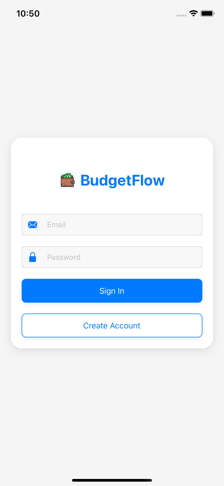
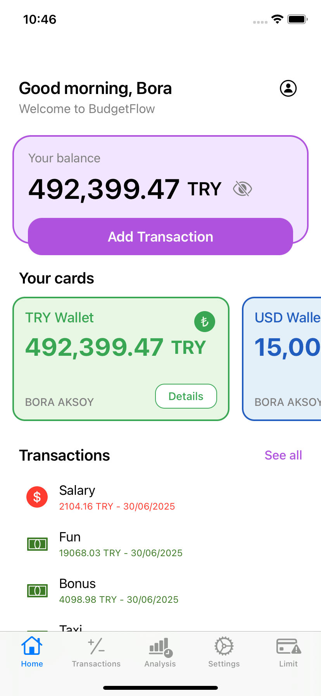
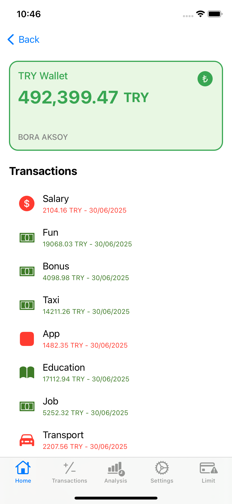
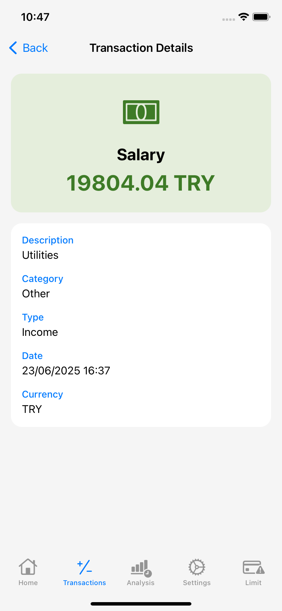
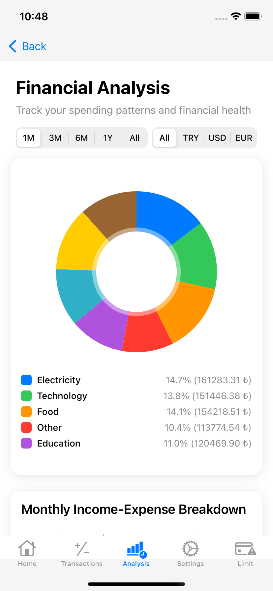
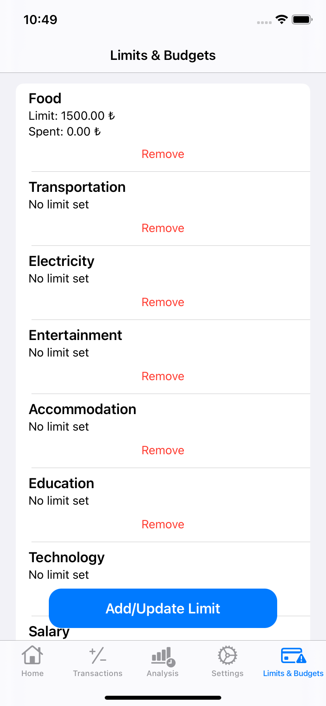
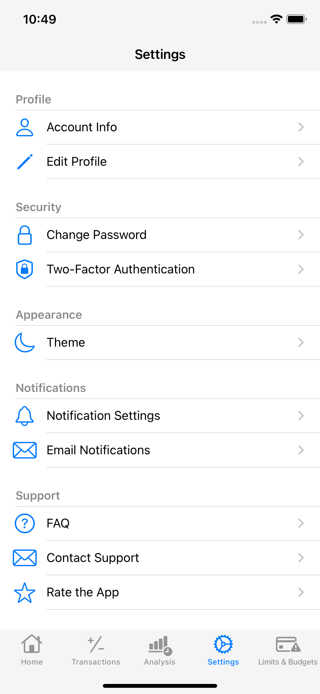

# BudgetFlow 📱💰

A comprehensive iOS financial management application built with Swift and Firebase, designed to help users track their expenses, manage multiple wallets, and gain insights into their spending patterns.

## 🌟 Features

### 💳 Multi-Wallet Management
- Support for multiple currencies (TRY, USD, EUR)
- Real-time balance tracking
- Individual wallet cards with visual design
- Currency-specific color themes

### 📊 Transaction Management
- Add, edit, and delete transactions
- Categorize expenses and income
- Photo attachment support
- Real-time transaction updates
- Smart transaction sorting by date

### 📈 Financial Analysis
- Interactive charts and graphs using DGCharts
- Expense breakdown by category (Pie Chart)
- Monthly income vs expense comparison (Bar Chart)
- Wallet balance visualization
- Customizable date ranges (1M, 3M, 6M, 1Y, All)

### 🎯 Budget & Limits
- Set spending limits by category
- Real-time limit tracking
- Warning notifications (80% threshold)
- Automatic spending calculation from limit start date

### 🤖 AI-Powered Predictions
- Machine Learning expense predictions
- Core ML integration for future spending estimates
- Historical data analysis

### 📄 Export & Reporting
- PDF export functionality
- Filtered transaction reports
- Custom date range selection
- Share reports via email or other apps

### 🔐 User Authentication
- Firebase Authentication
- Secure user registration and login
- Profile management
- Password change functionality

### ⚙️ Settings & Customization
- Theme settings
- Notification preferences
- Email notification settings
- FAQ and support contact

## 🛠 Technical Stack

- **Language**: Swift 5.0
- **Framework**: UIKit
- **Backend**: Firebase (Firestore, Authentication, Storage)
- **Charts**: DGCharts (Daniel Cohen Gindi Charts)
- **Machine Learning**: Core ML
- **Image Loading**: SDWebImage
- **PDF Generation**: PDFKit
- **Architecture**: MVC Pattern

## 📱 Screenshots

<div align="center">

### Authentication & Home



### Financial Management



### Analysis & Budgeting



### Settings


</div>

## 🚀 Installation

### Prerequisites
- Xcode 14.0 or later
- iOS 17.2 or later
- CocoaPods (optional, using Swift Package Manager)

### Setup Instructions

1. **Clone the repository**
   ```bash
   git clone https://github.com/yourusername/BudgetFlow.git
   cd BudgetFlow
   ```

2. **Open in Xcode**
   ```bash
   open BudgetFlow.xcodeproj
   ```

3. **Configure Firebase**
   - Create a new Firebase project at [Firebase Console](https://console.firebase.google.com/)
   - Download `GoogleService-Info.plist` and add it to your Xcode project
   - Enable Authentication, Firestore, and Storage in Firebase Console

4. **Build and Run**
   - Select your target device or simulator
   - Press `Cmd + R` to build and run the application

## 📁 Project Structure

```
BudgetFlow/
├── BudgetFlow/
│   ├── Assets.xcassets/          # App icons and images
│   ├── Base.lproj/              # Localization files
│   ├── Delegates/               # App and Scene delegates
│   ├── Extensions/              # Swift extensions
│   ├── Models/                  # Data models
│   ├── ViewControllers/         # UI Controllers
│   │   ├── Analysis/           # Financial analysis screens
│   │   ├── Home/               # Main dashboard
│   │   ├── Login/              # Authentication screens
│   │   ├── Settings/           # App settings
│   │   └── Transactions/       # Transaction management
│   ├── BudgetFlowModel.mlmodel # Core ML model
│   ├── GoogleService-Info.plist # Firebase configuration
│   └── Info.plist              # App configuration
└── README.md                   # This file
```

## 🎨 UI/UX Design

- **Modern Design**: Clean, intuitive interface following iOS design guidelines
- **Dark/Light Mode**: Automatic theme adaptation
- **Responsive Layout**: Optimized for all iPhone screen sizes
- **Smooth Animations**: Engaging user interactions
- **Accessibility**: VoiceOver and Dynamic Type support

## 🔧 Configuration

### Firebase Setup
1. Enable Email/Password authentication
2. Create Firestore database with security rules
3. Configure Storage for image uploads
4. Set up proper security rules

### Core ML Model
- The app includes a pre-trained `BudgetFlowModel.mlmodel`
- Used for expense prediction based on historical data
- Supports up to 3 months of historical data for predictions

## 📊 Data Models

### Transaction
```swift
struct Transaction {
    let title: String
    let description: String
    let amount: String
    let currency: String
    let category: String
    let type: String // "Income" or "Expense"
    let date: Timestamp
    let walletID: String
}
```

### Wallet
```swift
struct Wallet {
    let currency: String
    let balance: Double
    let walletID: String
}
```

## 🔐 Security Features

- Firebase Authentication for user management
- Secure data storage in Firestore
- Input validation and sanitization
- Secure password handling
- User data isolation

## 📈 Performance Optimizations

- Real-time listeners for live data updates
- Efficient image caching with SDWebImage
- Lazy loading for large datasets
- Optimized chart rendering
- Background data synchronization

## 🧪 Testing

The application includes:
- Unit tests for core functionality
- UI tests for critical user flows
- Integration tests for Firebase operations
- Performance testing for large datasets

## 👨‍💻 Developer

**Bora Aksoy**
- GitHub: [@aksoybora](https://github.com/aksoybora)

## 🙏 Acknowledgments

- [DGCharts](https://github.com/danielgindi/Charts) for chart functionality
- [SDWebImage](https://github.com/SDWebImage/SDWebImage) for image handling
- [Firebase](https://firebase.google.com/) for backend services
- Apple for Core ML and PDFKit frameworks


⭐ **Star this repository if you find it helpful!**

